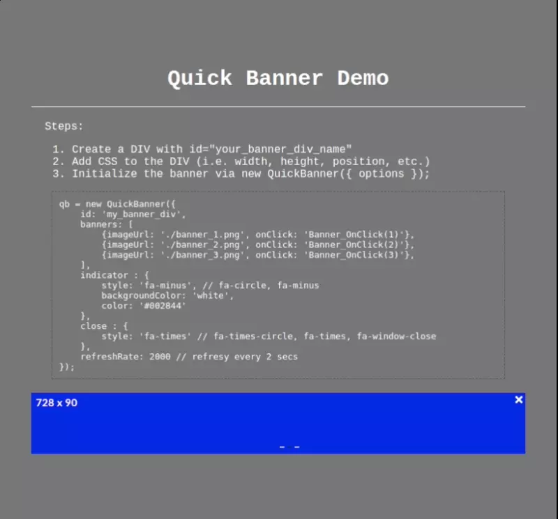

# QuickBanner

QuickBanner is a JavaScript library for creating sample banner.

## Requirements

QuickBanner requires [JQuery](https://jquery.com/) and [Font Awesome](https://fontawesome.com/). Please refer to [demo.html](https://github.com/michitect/quickbanner/blob/main/demo.html) for reference on how to set it up.

## Installation

Copy the [quickbanner.js](https://github.com/michitect/quickbanner/blob/main/quickbanner.js) to your working folder.

## Demo



## Usage

1. Create a DIV with id="your_banner_div_name"
2. Add CSS to the DIV (i.e. width, height, position, etc.)
3. Initialize the banner via new QuickBanner({ options });

```javascript
qb = new QuickBanner({
    id: 'my_banner_div', 
    banners: [ 
        {imageUrl: './banner_1.png', onClick: 'Banner_OnClick(1)'},
        {imageUrl: './banner_2.png', onClick: 'Banner_OnClick(2)'},
        {imageUrl: './banner_3.png', onClick: 'Banner_OnClick(3)'},
    ],
    indicator : {
        style: 'fa-minus', // fa-circle, fa-minus
        backgroundColor: 'white',
        color: '#002844'
    },
    close : {
        style: 'fa-times' // fa-times-circle, fa-times, fa-window-close
    },
    refreshRate: 2000 // refresy every 2 secs
```

## Demonstration

Open the [demo.html](https://github.com/michitect/quickbanner/blob/main/demo.html) in your working folder for demonstration.

## License
[MIT](https://choosealicense.com/licenses/mit/)
